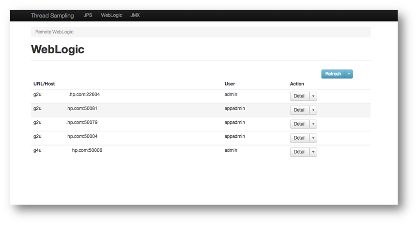
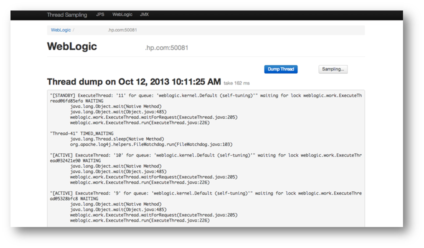
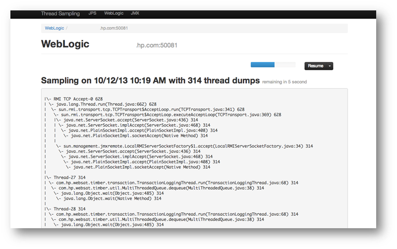

# Java Thread Dump Utility and Viewer #

[](https://travis-ci.org/feng-zh/thread-dump)

This repository contains advanced components to view java thread dump especially perform sampling with existing JVM process or JMX process (including WebLogic supported).

NOTE: The JDK 6/7/8/9 jstack sampling are all supported.

## Introduction ##

In Enterprise web application, we usually need to know which part impacting web application running on web servers. However, due to limited log or INFO log level on production, it cannot easily detect performance bottom neck, especially during heavy load in production.

### Get thread dump via different ways ###
`Java Thread dump` is a way to inspect current running application detail, and usually there are several ways to capture java thread dump:
- Inside JVM by using `java.lang.Thread` (same JVM)
- Simulate `jstack` (same machine)
- Use JMX (local or remote if JMX enabled)
- Use WebLogic interface (remote weblogic)

Here the generic API is developed to collect thread dump by using above methods depends on situation.

By leveraging this generic API, the sampling of thread dump are stored as file store for offline analysis, and also export REST web service via JDK internal web server.

### Perform thread dump or online-sampling via Web UI ###
This application uses HTML5 and JS MVC framework to perform thread sampling with jstack/jmx/weblogic ways. Here are demo screen for reference.

Access to thread dump Web application, suppose it is `http://127.0.0.1:8080/threads/`. Check `JPS` or `WebLogic` or `JMX` tabs.

For weblogic server, click dropdown list in `Refresh` button, and add new WebLogic server JMX connection information, such as `hostname:port` (Managed Server), and admin name/password. Then server connection information is listed as following:
  

Click server detail, and switch to server detail information page, click `Dump Thread` button to perform one time collection.
  

If try to perform sampling, click `Sampling...` button to start sampling. Some options can be configured for time period (duration), and frequency (time interval).
  

Once finished or in progress, the aggregated tree is presented in screen, and number in each stack trace means how many times it is collected. It can be used to determin which method is taking too much time during sampling. 

### Get Started ###

#### Download ####

Download latest version from <https://jitpack.io/com/github/feng-zh/thread-dump/v1.2.0/thread-dump-v1.2.0-jar-with-dependencies.jar>, 
and rename it as `thread-dump-jar-with-dependencies.jar`.

#### Build ####

If want to build by self, use `maven` to build application from git source code

```shell
git clone https://github.com/feng-zh/thread-dump.git

cd thread-dump

mvn package
```
The build package is ready in `thread-dump/target/thread-dump-jar-with-dependencies.jar`.

#### Run ####

```shell
java -jar thread-dump-jar-with-dependencies.jar 8080
```

The application will be started and listening on port 8080 in host. It can be accessed via `http://127.0.0.1:8080/threads/` (**NOTE:** Please rember to add tailer / in path in this version.)

####  Run with WebLogic supported ####

Locate the weblogic installed folder, and copy two jar files `wlclient.jar` and `wljmxclient.jar` from `WL_HOME/server/lib` folder into application folder. 

*Due to WebLogic library are not open source, so not provided here.*

For Linux System:

```shell
java -classpath wlclient.jar:wljmxclient.jar -jar thread-dump-jar-with-dependencies.jar 8080
```

For Windows System:

```shell
java -classpath wlclient.jar;wljmxclient.jar -jar thread-dump-jar-with-dependencies.jar 8080
``` 

The use same step mentioned above.

## Contribution ##
If any interesting java internal function want to add, please contact author. Welcome to fork this repository with your innovation.

